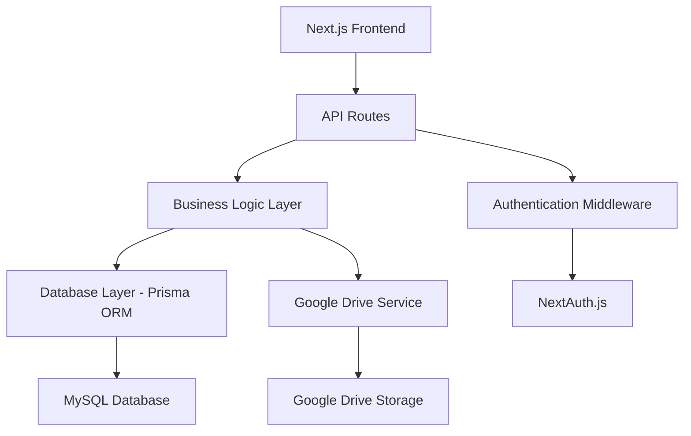

# API Layer Design Document

## Overview

This design document outlines the implementation of a comprehensive API layer for the Next.js application. The API will provide RESTful endpoints for managing events, user registrations, gallery images, videos, and admin functionality. The system will integrate with Google Drive for media storage and use MySQL with an ORM for data persistence.

## Architecture

### Technology Stack

- **Framework**: Next.js API Routes (App Router)
- **Database**: MySQL
- **ORM**: Prisma (recommended for TypeScript support and type safety)
- **File Storage**: Google Drive API
- **Authentication**: NextAuth.js with JWT
- **Validation**: Zod for schema validation
- **Image Processing**: Sharp for optimization

### System Architecture



### Directory Structure

```
src/
├── app/
│   └── api/
│       ├── auth/
│       │   ├── login/route.ts
│       │   └── logout/route.ts
│       ├── events/
│       │   ├── route.ts
│       │   ├── [id]/route.ts
│       │   └── [id]/register/route.ts
│       ├── admin/
│       │   ├── events/route.ts
│       │   ├── events/[id]/route.ts
│       │   ├── registrations/[eventId]/route.ts
│       │   ├── gallery/route.ts
│       │   ├── videos/route.ts
│       │   └── dashboard/stats/route.ts
│       └── gallery/
│           ├── route.ts
│           └── event/[eventId]/route.ts
├── lib/
│   ├── services/
│   │   ├── event.service.ts
│   │   ├── registration.service.ts
│   │   ├── gallery.service.ts
│   │   ├── video.service.ts
│   │   └── drive.service.ts
│   ├── utils/
│   │   ├── db.ts
│   │   ├── auth.ts
│   │   ├── response.ts
│   │   └── constants.ts
│   └── validations/
│       ├── event.validation.ts
│       ├── registration.validation.ts
│       ├── gallery.validation.ts
│       └── video.validation.ts
├── types/
│   ├── api.types.ts
│   ├── event.types.ts
│   └── user.types.ts
└── prisma/
    ├── schema.prisma
    └── migrations/
```

### Code Organization Principles

- **Single Responsibility**: Each file handles one specific concern
- **Maximum 300 lines per file**: Large files will be split into smaller, focused modules
- **Service Layer Pattern**: Business logic separated from API routes
- **Utility Functions**: Common functionality extracted into reusable utilities
- **Type Safety**: Comprehensive TypeScript interfaces and validation

## Components and Interfaces

### Maintainability Guidelines

**File Size Limit**: All files must be under 300 lines to ensure readability and maintainability.

**Service Layer Pattern**:

- API routes handle HTTP concerns only (validation, response formatting)
- Business logic resides in service classes
- Database operations are abstracted through service methods
- Each service handles a single domain (events, registrations, etc.)

**Function Complexity**:

- Functions should be small and focused (max 50 lines)
- Complex operations split into multiple helper functions
- Clear naming conventions for all functions and variables
- Comprehensive error handling in each function

**Code Reusability**:

- Common utilities extracted into shared modules
- Validation schemas reused across routes
- Response formatting standardized
- Database connection and configuration centralized

### Database Schema (Prisma)

```prisma
model User {
  id        String   @id @default(cuid())
  email     String   @unique
  password  String
  name      String
  role      Role     @default(ADMIN)
  createdAt DateTime @default(now())
  updatedAt DateTime @updatedAt
}

model Event {
  id            String         @id @default(cuid())
  title         String
  description   String?        @db.Text
  date          DateTime
  time          String
  venue         String
  capacity      Int
  flyerUrl      String?
  status        EventStatus    @default(ACTIVE)
  createdAt     DateTime       @default(now())
  updatedAt     DateTime       @updatedAt
  registrations Registration[]
  galleries     Gallery[]
  videos        Video[]
}

model Registration {
  id              String           @id @default(cuid())
  eventId         String
  firstName       String
  lastName        String
  email           String
  phone           String
  status          StudentStatus
  course          String?
  areaOfInterest  String
  expectations    String?         @db.Text
  registeredAt    DateTime        @default(now())
  event           Event           @relation(fields: [eventId], references: [id], onDelete: Cascade)

  @@unique([eventId, email])
}

model Gallery {
  id          String   @id @default(cuid())
  eventId     String?
  title       String
  driveFileId String
  driveUrl    String
  thumbnailUrl String?
  createdAt   DateTime @default(now())
  event       Event?   @relation(fields: [eventId], references: [id], onDelete: SetNull)
}

model Video {
  id          String      @id @default(cuid())
  eventId     String?
  title       String
  description String?     @db.Text
  driveFileId String
  driveUrl    String
  thumbnailUrl String?
  category    VideoCategory @default(EVENT)
  createdAt   DateTime    @default(now())
  event       Event?      @relation(fields: [eventId], references: [id], onDelete: SetNull)
}

enum Role {
  ADMIN
}

enum EventStatus {
  ACTIVE
  INACTIVE
  COMPLETED
}

enum StudentStatus {
  STUDENT
  GRADUATE
}

enum VideoCategory {
  EVENT
  CONTENT
  PROMOTIONAL
}
```

### API Endpoints

#### Authentication Endpoints

- `POST /api/auth/login` - Admin login
- `POST /api/auth/logout` - Admin logout
- `GET /api/auth/session` - Get current session

#### Event Management

- `GET /api/events` - Get all active events (public)
- `GET /api/events/[id]` - Get specific event (public)
- `POST /api/admin/events` - Create new event (admin)
- `PUT /api/admin/events/[id]` - Update event (admin)
- `DELETE /api/admin/events/[id]` - Delete event (admin)
- `GET /api/admin/events` - Get all events with admin details

#### Registration Management

- `POST /api/events/[id]/register` - Register for event (public)
- `GET /api/admin/events/[id]/registrations` - Get event registrations (admin)
- `GET /api/admin/registrations/export/[eventId]` - Export registrations (admin)

#### Gallery Management

- `GET /api/gallery` - Get all gallery images (public)
- `GET /api/gallery/event/[eventId]` - Get images for specific event (public)
- `POST /api/admin/gallery` - Upload images (admin)
- `DELETE /api/admin/gallery/[id]` - Delete image (admin)
- `PUT /api/admin/gallery/[id]` - Update image metadata (admin)

#### Video Management

- `GET /api/videos` - Get all videos (public)
- `GET /api/videos/category/[category]` - Get videos by category (public)
- `POST /api/admin/videos` - Upload video (admin)
- `DELETE /api/admin/videos/[id]` - Delete video (admin)
- `PUT /api/admin/videos/[id]` - Update video metadata (admin)

#### Dashboard Analytics

- `GET /api/admin/dashboard/stats` - Get dashboard statistics (admin)

### Google Drive Integration

#### Service Configuration

```typescript
interface GoogleDriveConfig {
  clientId: string;
  clientSecret: string;
  refreshToken: string;
  folderId: string; // Root folder for application files
}

interface DriveService {
  uploadFile(
    file: Buffer,
    fileName: string,
    mimeType: string,
    folderId?: string
  ): Promise<DriveFile>;
  createFolder(name: string, parentId?: string): Promise<DriveFolder>;
  deleteFile(fileId: string): Promise<void>;
  getFileUrl(fileId: string): Promise<string>;
  generateThumbnail(fileId: string): Promise<string>;
}
```

#### Folder Structure in Google Drive

```
Application Root/
├── Events/
│   ├── Event-1-Images/
│   ├── Event-1-Videos/
│   ├── Event-2-Images/
│   └── Event-2-Videos/
├── General-Content/
│   ├── Images/
│   └── Videos/
└── Thumbnails/
```

## Data Models

### TypeScript Interfaces

```typescript
interface Event {
  id: string;
  title: string;
  description?: string;
  date: Date;
  time: string;
  venue: string;
  capacity: number;
  flyerUrl?: string;
  status: "ACTIVE" | "INACTIVE" | "COMPLETED";
  registrationCount?: number;
  availableSpots?: number;
}

interface Registration {
  id: string;
  eventId: string;
  firstName: string;
  lastName: string;
  email: string;
  phone: string;
  status: "STUDENT" | "GRADUATE";
  course?: string;
  areaOfInterest: string;
  expectations?: string;
  registeredAt: Date;
}

interface GalleryImage {
  id: string;
  eventId?: string;
  title: string;
  driveFileId: string;
  driveUrl: string;
  thumbnailUrl?: string;
  createdAt: Date;
}

interface Video {
  id: string;
  eventId?: string;
  title: string;
  description?: string;
  driveFileId: string;
  driveUrl: string;
  thumbnailUrl?: string;
  category: "EVENT" | "CONTENT" | "PROMOTIONAL";
  createdAt: Date;
}
```

### Validation Schemas (Zod)

```typescript
const EventSchema = z.object({
  title: z.string().min(1).max(200),
  description: z.string().optional(),
  date: z.string().datetime(),
  time: z.string().min(1),
  venue: z.string().min(1),
  capacity: z.number().positive(),
  status: z.enum(["ACTIVE", "INACTIVE", "COMPLETED"]).optional(),
});

const RegistrationSchema = z.object({
  firstName: z.string().min(1).max(50),
  lastName: z.string().min(1).max(50),
  email: z.string().email(),
  phone: z.string().min(10).max(15),
  status: z.enum(["STUDENT", "GRADUATE"]),
  course: z.string().optional(),
  areaOfInterest: z.string().min(1),
  expectations: z.string().optional(),
});
```

## Error Handling

### Error Response Format

```typescript
interface ApiError {
  success: false;
  error: {
    code: string;
    message: string;
    details?: any;
  };
  timestamp: string;
}

interface ApiSuccess<T> {
  success: true;
  data: T;
  timestamp: string;
  pagination?: {
    page: number;
    limit: number;
    total: number;
    totalPages: number;
  };
}
```

### Error Codes

- `VALIDATION_ERROR` - Input validation failed
- `NOT_FOUND` - Resource not found
- `UNAUTHORIZED` - Authentication required
- `FORBIDDEN` - Insufficient permissions
- `CAPACITY_EXCEEDED` - Event at full capacity
- `DUPLICATE_REGISTRATION` - User already registered
- `DRIVE_ERROR` - Google Drive operation failed
- `DATABASE_ERROR` - Database operation failed

## Testing Strategy

### Unit Tests

- API route handlers
- Business logic functions
- Validation schemas
- Google Drive service methods
- Database operations

### Integration Tests

- Complete API workflows
- Database transactions
- Google Drive file operations
- Authentication flows

### Test Structure

```
__tests__/
├── api/
│   ├── events.test.ts
│   ├── registrations.test.ts
│   ├── gallery.test.ts
│   └── videos.test.ts
├── services/
│   ├── google-drive.test.ts
│   └── database.test.ts
└── utils/
    └── validation.test.ts
```

### Testing Tools

- Jest for unit testing
- Supertest for API testing
- Prisma test database
- Mock Google Drive API responses

## Security Considerations

### Authentication & Authorization

- JWT tokens with secure httpOnly cookies
- Role-based access control
- Session management with NextAuth.js
- CSRF protection

### Data Validation

- Input sanitization using Zod
- SQL injection prevention via Prisma ORM
- File upload validation (type, size limits)
- Rate limiting on public endpoints

### Google Drive Security

- OAuth 2.0 authentication
- Scoped permissions (drive.file)
- Secure credential storage
- File access controls

## Performance Optimizations

### Database

- Proper indexing on frequently queried fields
- Connection pooling
- Query optimization with Prisma
- Pagination for large datasets

### File Handling

- Image compression before upload
- Thumbnail generation
- CDN-like serving through Google Drive
- Lazy loading for gallery images

### Caching Strategy

- API response caching for public endpoints
- Database query result caching
- Static asset caching
- Browser caching headers

## Deployment Considerations

### Environment Variables

```
DATABASE_URL=mysql://...
GOOGLE_DRIVE_CLIENT_ID=...
GOOGLE_DRIVE_CLIENT_SECRET=...
GOOGLE_DRIVE_REFRESH_TOKEN=...
GOOGLE_DRIVE_FOLDER_ID=...
NEXTAUTH_SECRET=...
NEXTAUTH_URL=...
```

### Database Migration

- Prisma migration system
- Seed data for initial setup
- Backup strategy for production
- Environment-specific configurations
